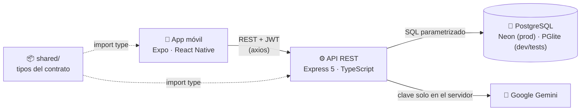

<div align="center">

# 🕒 HueckoApp

### Encuentra el hueco perfecto para juntarte con tu grupo ✨

*Cruza horarios automáticamente, vota planes, gestiona imprevistos y deja que la IA lea tu horario desde una foto.*


[🚀 Inicio rápido](#-inicio-rápido-en-5-pasos) ·
[🧭 Cómo se usa](#-cómo-se-usa-la-app) ·
[🗄️ Producción](#️-base-de-datos-en-producción-neon) ·
[🛡️ Administración](#️-administración-de-la-app) ·
[🚧 Pendientes](#-estado-y-pendientes) ·
[📜 API](docs/api.md)

</div>

---

## 📌 ¿Qué es HueckoApp?

HueckoApp reúne la disponibilidad de grupos de amigos, compañeros de universidad o de trabajo:

| | Función |
|---|---|
| 📅 | **Tu horario semanal** en bloques, escrito a mano o leído desde una foto con IA |
| 👥 | **Grupos** con código de invitación y roles (dueño / miembro) |
| 🔍 | **Cruce automático** de agendas: muestra los huecos libres en común |
| 🗳️ | **Propuestas y votación** de planes, con plazo, lugar y ubicación en el mapa |
| ⚠️ | **Imprevistos**: si alguien ya no puede, el plan se reabre |
| 🤖 | **Huecko IA**: OCR de horarios, borrador de plan desde una frase, ideas de plan y resumen de la votación |
| 📊 | **Panel de administración**: estadísticas, gráficos, informes PDF/CSV, usuarios, grupos y registro de acciones |

---

## 🏗️ Arquitectura



### 📁 Estructura del monorepo

| Carpeta | Qué contiene | Tecnología |
|---|---|---|
| 📱 [`mobile/`](mobile/) | App móvil | Expo SDK 57 + React Native 0.86 + TypeScript, React Navigation 7 |
| ⚙️ [`backend/`](backend/) | API REST, base de datos e IA | Node.js + Express 5 + TypeScript, zod, JWT, bcrypt |
| 📦 [`shared/`](shared/) | Tipos del contrato (`@hueckoapp/shared`) | TypeScript (solo tipos) |
| 📜 [`docs/`](docs/) | Contrato de la API ([`api.md`](docs/api.md)) y planes | Markdown |
| 🗃️ [`legacy-android/`](legacy-android/) | Versión nativa anterior, congelada en `v1.0.0` | Kotlin + Jetpack Compose |

> 💡 Es un **monorepo con npm workspaces**: un solo `npm install` en la raíz instala todo, con un único `package-lock.json`.
> El **contrato de la API** ([`docs/api.md`](docs/api.md)) es el acuerdo entre la app y el backend: cualquier cambio de endpoint se actualiza ahí en el mismo PR.

---

## ✅ Requisitos

| | Qué | Nota |
|---|---|---|
| 🟢 | [Node.js](https://nodejs.org/) **22.13 o superior** + npm | Obligatorio |
| 🌿 | Git | Obligatorio |
| 📲 | **Expo Go** en tu celular, o un emulador de Android Studio | Para abrir la app |
| 🐘 | Base de datos | **No hay que instalar nada**: en desarrollo se usa [PGlite](https://pglite.dev) (PostgreSQL dentro del propio proceso, sin Postgres ni Docker) |
| 🔑 | Clave de Gemini | Opcional: sin ella la IA funciona en *modo demostración* |

---

## 🚀 Inicio rápido en 5 pasos

### 1️⃣ Clonar e instalar (una sola vez)

```bash
git clone https://github.com/Alessandro-BS/HueckoApp-Android.git
cd HueckoApp-Android
npm install
```

### 2️⃣ Configurar el backend

```bash
cp backend/.env.example backend/.env
```

Abre `backend/.env` y completa `JWT_SECRET` con un valor largo y aleatorio:

```bash
node -e "console.log(require('crypto').randomBytes(48).toString('hex'))"
```

> 🔒 `backend/.env` **nunca se sube al repositorio**. Ahí viven los secretos: `JWT_SECRET`, `GEMINI_API_KEY` y `DATABASE_URL`.

### 3️⃣ (Opcional) Cargar datos de ejemplo

```bash
npm run seed -w backend
```

Crea usuarios, grupos, horarios y dos planes con fechas relativas a hoy. Se puede repetir sin duplicar nada (renueva los planes).

| 👤 Correo | 🔑 Contraseña | Qué tiene |
|---|---|---|
| `test@test.com` | `password123` | Administra «Proyecto Integrador» (código `PROY2026`) con Ana. Clases lunes 08–10 y miércoles 14–16. Creó «Reunión de avance del proyecto», confirmada para dentro de 2 días a las 11:00, con un imprevisto de Ana (sale el aviso en Inicio) |
| `ana@test.com` | `password123` | Miembro de «Proyecto Integrador». Propuso «Repaso antes de la entrega», en votación hasta mañana a las 20:00 |
| `carlos@test.com` | `password123` | Único miembro de «Amigos de la Uni»: prueba **Unirme** con el código `HUECKO123` |
| `admin@test.com` | `password123` | 🛡️ Rol `ADMIN`: ve «Administración» en el menú. No pertenece a ningún grupo |

### 4️⃣ Levantar el backend

```bash
npm run backend
```

✔️ Comprueba que responde: <http://localhost:3000/api/health>

### 5️⃣ Levantar la app (en otra terminal)

```bash
cp mobile/.env.example mobile/.env
npm run mobile
```

📲 Escanea el QR con **Expo Go**, o presiona **`a`** para abrir el emulador de Android.

> ⚠️ **¿A qué dirección apunta la app?** Se configura en `EXPO_PUBLIC_API_URL` de `mobile/.env`:
> - 🖥️ **Emulador de Android:** `localhost` es el propio emulador; para llegar a tu PC usa `http://10.0.2.2:3000/api` (el valor por defecto).
> - 📱 **Celular físico:** usa la IP de tu PC en la red Wi-Fi (por ejemplo `http://192.168.1.20:3000/api`), con ambos en la misma red.

🎉 **¡Listo!** Entra con una cuenta de ejemplo o crea la tuya desde **«Regístrate»**.

---

## 🧭 Cómo se usa la app

1. 📝 **Regístrate o inicia sesión.** El token se guarda cifrado en el teléfono.
2. 📅 **Carga tu horario** en «Mi horario»: agrega bloques a mano o pulsa **📷 Escanear horario** para que la IA los lea de una foto. Revisa el resultado antes de guardarlo.
3. 👥 **Crea un grupo** y comparte su código de invitación, o **únete** con un código.
4. 🔍 **Mira la disponibilidad** en la pestaña del grupo: los huecos libres que tienen todos en común.
5. 🗳️ **Propón un plan** eligiendo un hueco, o escribe una frase como *«pichanga el sábado en la tarde»* y deja que ✨ la IA arme el borrador. También puedes pedirle 💡 ideas de plan.
6. 📍 **Agrega el lugar** con tu ubicación actual y ábrelo en el mapa.
7. ✅ **Vota.** El responsable confirma el plan cuando hay acuerdo, y la IA puede 📋 resumir la votación.
8. ⚠️ **¿Surgió algo?** Reporta un imprevisto: el responsable decide si el plan sigue o se reabre.
9. 🏠 **Inicio** te muestra tu próximo plan, tus grupos, las votaciones abiertas y los avisos de imprevistos.

---

## 🤖 Huecko IA (opcional)

1. Consigue una clave gratis en 👉 <https://aistudio.google.com/apikey>
2. Pégala en `GEMINI_API_KEY` de `backend/.env`.
3. Reinicia el backend. ¡Eso es todo!

| Variable | Por defecto | Para qué |
|---|---|---|
| `GEMINI_MODEL` | `gemini-3.5-flash-lite` | Modelo principal: responde en pocos segundos, también el OCR |
| `GEMINI_FALLBACK_MODEL` | `gemini-3.5-flash` | Se prueba una vez si el principal está saturado (503), sin cuota (429), no existe (404) o tarda demasiado |
| `GEMINI_THINKING_LEVEL` | `low` | Menos razonamiento = respuestas más rápidas |
| `GEMINI_TIMEOUT_MS` | `30000` | Tiempo máximo total; después responde `503 AI_UNAVAILABLE` |
| `AI_RATE_LIMIT` | `20` | Llamadas por usuario cada 15 minutos |

> 🧪 Sin clave, la IA responde con datos de ejemplo y la app muestra **«Modo demostración»**.
> 🔐 La clave **nunca** va en la app: solo el servidor habla con Gemini. Todo texto del usuario se envía marcado como dato (no como instrucciones) y cada respuesta se valida con zod.

---

## 🐘 Base de datos

### 💻 En desarrollo: PGlite

Con `DATABASE_URL` vacía (lo normal en desarrollo), el backend guarda todo en PostgreSQL con PGlite, en `backend/data/pglite`. La carpeta se crea sola al arrancar, con todas las tablas.

> ⚠️ **PGlite admite un solo proceso.** Detén el servidor antes de `npm run seed -w backend` o `npm run make-admin -w backend`. Si no lo haces, te avisan: «La base local … está abierta por otro proceso».

- 🔄 **Empezar de cero:** detén el servidor y borra `backend/data/pglite`.
- 🗑️ El archivo `backend/data/hueckoapp.db` de la versión con SQLite ya no se usa y se puede borrar (la semilla vuelve a crear los datos de ejemplo).

### ☁️ Base de datos en producción (Neon)

1. 🆕 Crea un proyecto en [Neon](https://console.neon.tech) con **Postgres 18** (la versión por defecto; hace falta 16 o posterior), **en la misma región que el servicio de Render** o la más cercana. Cada consulta es un viaje de red y algunas pantallas (como los informes de administración) hacen una docena seguidas.
2. 🔗 En **Connect**, copia la cadena de conexión (la *pooled* sirve) y cambia `sslmode=require` por `sslmode=verify-full` (mismo cifrado, sin el aviso de seguridad de `pg`).
3. 🔒 Ponla en `DATABASE_URL` del entorno del servidor, **nunca en el repo ni en la app**. Con `NODE_ENV=production` el servidor no arranca sin ella.
   - ⏱️ Tiempos máximos (en `backend/src/db/pg-driver.ts`): Postgres cancela a los **15 s** una sentencia dentro de una transacción (`SET LOCAL statement_timeout`, compatible con la conexión *pooled*), y el servidor deja de esperar cualquier consulta a los **20 s**.
4. 🧱 Al arrancar, el servidor crea o actualiza las tablas solo (migraciones en `backend/src/db/migrations.ts`, anotadas en `schema_migrations`).
5. 🛡️ **Primer administrador:** ejecuta `make-admin` con la `DATABASE_URL` de producción **solo para ese comando**, en la terminal. **Nunca la escribas en `backend/.env`**: así ni `npm run backend` ni la semilla tocan producción por descuido. Una variable definida en la terminal gana a `backend/.env`:

   ```bash
   # bash
   DATABASE_URL='postgresql://…' npm run make-admin -w backend -- <correo>
   ```

   ```powershell
   # PowerShell
   $env:DATABASE_URL='postgresql://…'; npm run make-admin -w backend -- <correo>; Remove-Item Env:DATABASE_URL
   ```

   - `make-admin` solo abre una base que ya tenga el esquema **en la misma versión que tu copia del código**. No la migra (eso lo hace el servidor desplegado al arrancar), así que despliega antes y usa el mismo commit.
   - 🚫 La semilla es solo para desarrollo: si `DATABASE_URL` no apunta a esta máquina, se niega a escribir (salvo con `-- --allow-remote`, para una base de pruebas), porque crea cuentas con contraseña conocida, una de ellas ADMIN.
6. 🧪 **Antes de desplegar en Render**, arranca el servidor una vez contra un proyecto Neon de pruebas (con su `DATABASE_URL` real) y comprueba salud, inicio de sesión, Inicio y `make-admin`. Los tests no usan red, así que Neon no se prueba automáticamente.

---

## 🌐 Despliegue del backend (Render)

| Variable | Valor recomendado | ¿Por qué? |
|---|---|---|
| `NODE_ENV` | `production` | Exige `DATABASE_URL` y desactiva comportamientos de desarrollo |
| `DATABASE_URL` | Cadena de Neon con `sslmode=verify-full` | Base de datos de producción |
| `JWT_SECRET` | Valor largo y aleatorio (distinto al de desarrollo) | Firma de los tokens |
| `TZ` | `America/Lima` | 🕐 Los planes confirmados (`scheduledAt`, `scheduledDate`) se calculan en esta zona. Sin ella el servidor usa UTC y los planes caerían en otra fecha u hora |
| `TRUST_PROXY` | `1` | 🧱 Render pone un proxy delante. Sin esto, todas las peticiones parecen venir de la misma IP y el límite de intentos de login (`LOGIN_RATE_LIMIT`) y de registro (`REGISTER_RATE_LIMIT`) bloquearía a todos a la vez |
| `GEMINI_API_KEY` | Tu clave | IA (opcional) |

> ⚙️ Comandos: build `npm install && npm run build -w backend` · start `npm start -w backend`.

---

## 🛡️ Administración de la app

Una cuenta con rol `ADMIN` ve **«Administración»** en el menú lateral (botón ☰ arriba a la izquierda), con 5 pestañas:

| | Pestaña | Qué hace |
|---|---|---|
| 📊 | Estadísticas | Totales y gráficos de usuarios, grupos, planes y uso de la IA |
| 📄 | Informes | Filtro por fechas y exportación a **PDF** y **CSV** |
| 👤 | Usuarios | Buscar, suspender o reactivar, dar o quitar el rol de administrador |
| 👥 | Grupos | Ver detalle, cancelar planes y eliminar grupos |
| 📜 | Registro | Historial de cada acción de administración |

🔑 **Nadie se hace administrador al registrarse ni desde la API**: el rol se da o se quita **desde la consola del servidor**:

```bash
npm run make-admin -w backend -- ana@test.com            # ➕ dar el rol
npm run make-admin -w backend -- ana@test.com --revoke   # ➖ quitarlo
```

- Usa la base de `backend/.env` (`DATABASE_URL` o, si está vacía, PGlite en `PGLITE_DATA_DIR`).
- Solo abre una base que ya exista con el esquema de HueckoApp en la versión de este código: si la carpeta o la URL están mal, lo dice en vez de crear una vacía; si le faltan migraciones, pide arrancar antes el servidor.
- Con la base local, detén antes el servidor (PGlite admite un solo proceso).
- No deja la app sin ningún administrador activo, y queda en el registro como «Consola del servidor».
- La persona ve (o deja de ver) el menú **al volver la app al primer plano, al reabrirla o al iniciar sesión**. Si pierde el rol mientras usa «Administración», la app lo detecta en la siguiente petición y sale de esas pantallas.

---

## 🧰 Comandos útiles

| Dónde | Comando | Para qué |
|---|---|---|
| raíz | `npm run backend` | ⚙️ Levantar la API en <http://localhost:3000> |
| raíz | `npm run mobile` | 📱 Levantar la app con Expo |
| raíz | `npm test` | 🧪 Tests del backend (Vitest + Supertest, cada test con su base PGlite en memoria) y de mobile (Jest). Fijan solos `TZ=America/Lima`, así que pasan igual en cualquier PC o CI |
| raíz | `npm run typecheck` | 🔎 Revisar tipos de backend y mobile |
| raíz | `npm run build -w backend` | 🏗️ Compilar el backend a JavaScript |
| raíz | `npm run seed -w backend` | 🌱 Datos de ejemplo en la base local (con el servidor detenido) |
| raíz | `npm run make-admin -w backend -- <correo> [--revoke]` | 🛡️ Dar o quitar el rol de administrador |
| `mobile/` | `npx expo install <paquete>` | 📦 Instalar paquetes compatibles con el SDK (**no uses `npm install`** para librerías nativas) |
| `mobile/` | `npx expo-doctor` | 🩺 Diagnosticar dependencias |

---

## 🎓 Temas del curso y dónde se aplican

| Tema | Dónde |
|---|---|
| 🪝 **Hooks** | `useState`/`useEffect`, `AuthContext` y hooks propios en `mobile/src/hooks/`: genéricos (`useResource`, `useAction`, `useVoteToggle`, `useRefreshOnFocus`, `useRefreshErrorToast`, `usePagedList`) y de dominio (`useSchedule`, `useGroups`, `useGroup`, `useAvailability`, `useProposals`, `useProposal`, `useDashboard`, `useCurrentLocation`, `useScheduleOcr`, `useProposalDraft`, `useAiSuggestions`, `useVotingSummary`, `useAiStatus`, `useAdminStats`, `useAdminReport`, `useAdminUsers`, `useAdminGroups`, `useAdminAudit`, `useAdminUser`, `useAdminGroup`) |
| 🔐 **Seguridad en Android** | Token JWT en `expo-secure-store`, permisos en tiempo de ejecución, contraseñas con bcrypt y claves de IA solo en el backend. **Autorización por roles** (`USER`/`ADMIN`): el servidor lee rol y estado de la base en cada petición (`requireAuth` y `requireAdmin` en `backend/src/auth/require-auth.ts`), nadie se hace administrador por la API, una cuenta suspendida queda fuera al instante y cada acción de administración queda registrada |
| 📍 **Localización** | `expo-location` en `mobile/src/hooks/useCurrentLocation.ts`: permiso de ubicación en primer plano (texto en el plugin de `app.json`), posición actual y geocodificación inversa para el lugar de un plan; «Abrir en el mapa» con `Linking` (`geo:` en Android) |
| 🌐 **Consumo de APIs REST** | Cliente `axios` en `mobile/src/api/` contra el backend Express |
| 🐘 **Base de datos** | PostgreSQL: Neon en producción (driver `pg` con pool de conexiones) y PGlite en desarrollo y tests, detrás de una misma interfaz (`backend/src/db/db.ts`) con consultas parametrizadas, transacciones reales y migraciones versionadas |
| 🧭 **Navegación** | `native-stack` (flujos), `bottom-tabs` (barra inferior: Inicio, Horario y Grupos), `drawer` (menú ☰: Perfil, Cerrar sesión y «Administración» solo con rol `ADMIN`) y `material-top-tabs` (pestañas del grupo y del panel de administración) |
| 📷 **Cámara y galería** | `expo-image-picker` en `mobile/src/utils/scheduleImage.ts`: permiso de cámara en tiempo de ejecución, selector de fotos del sistema y validación de tipo y tamaño antes de subir (HEIC se convierte a JPG) |
| 🤖 **Inteligencia artificial** | Google Gemini **solo desde el backend** (`backend/src/ai/`, SDK `@google/genai`): OCR de horarios, borrador de propuesta desde una frase, ideas de plan y resumen de votación. Respuestas validadas con zod, límite por usuario y modo demostración sin clave |
| 📊 **Gráficos e informes** | `mobile/src/screens/admin/`: gráficos con `react-native-gifted-charts`, PDF generado en el teléfono con `expo-print`, CSV con `expo-file-system`, ambos compartidos con `expo-sharing`. Los números los calcula el servidor (`backend/src/admin/stats.ts`) |

---

## 🚧 Estado y pendientes

### 🗺️ Hoja de ruta

- [x] **Fase 0** — Monorepo, base de `mobile/` y `backend/`, contrato de la API
- [x] **Fase 1** — Autenticación (JWT + SecureStore) y navegación completa
- [x] **Fase 2** — Grupos, horarios y cruce de disponibilidad
- [x] **Fase 3** — Propuestas, votación y ubicación
- [x] **Fase 4** — IA: OCR de horarios y ayuda para organizar planes
- [x] **Fase 4.5** — Administración: roles, estadísticas, informes (PDF y CSV), usuarios, grupos y registro de acciones
- [x] **Migración a PostgreSQL** — Neon en producción y PGlite en desarrollo y tests (PR #25)
- [ ] **Fase 5** — Pruebas en dispositivo, despliegue, APK y versión `v2.0.0` 👇

### 📋 Lo que falta (en orden)

| # | Tarea | Detalle |
|---|---|---|
| 1️⃣ | 📱 **Pruebas en un celular** | Con Expo Go, siguiendo la lista de abajo |
| 2️⃣ | 🧪 **Probar contra Neon** | Proyecto de pruebas con `DATABASE_URL` real (endpoint *pooled*): salud, login, Inicio y `make-admin` |
| 3️⃣ | 🌐 **Desplegar en Render** | Backend conectado a Neon, con las variables de [Despliegue](#-despliegue-del-backend-render) |
| 4️⃣ | 📦 **Generar el APK** | Con EAS Build (`eas.json` con perfil `preview` que genera APK; requiere `npx eas login`). La app debe apuntar a la URL de Render (`EXPO_PUBLIC_API_URL=https://<servicio>.onrender.com/api`) |
| 5️⃣ | 🏷️ **Publicar `v2.0.0`** | Rama `release/2.0.0` → PR a `main` con el tag `v2.0.0` → de vuelta a `develop` |

### ✅ Lista de prueba en el celular

**Funciones principales**
- [ ] 📝 Registro, inicio y cierre de sesión (al reabrir la app, la sesión sigue).
- [ ] 📅 Crear, editar y borrar bloques de horario.
- [ ] 📷 Escanear un horario con la cámara y con una foto de la galería (incluida una HEIC del iPhone, si hay).
- [ ] 👥 Crear un grupo, unirse con código y salir de un grupo.
- [ ] 🔍 Ver la disponibilidad del grupo.
- [ ] 🗳️ Proponer un plan, votar, confirmar, cancelar y reportar un imprevisto.
- [ ] ✨ Borrador con IA, 💡 ideas de plan y 📋 resumen de la votación.
- [ ] 📍 Usar mi ubicación (aceptando y rechazando el permiso) y abrir el lugar en el mapa.

**Administración** (gráficos, PDF, CSV y compartir solo se prueban con mocks en Jest)
- [ ] 🛡️ Entrar como `admin@test.com` y abrir las 5 pestañas (etiquetas de los gráficos legibles).
- [ ] 📄 En «Informes», exportar PDF y CSV y abrir los dos (nombre `informe-hueckoapp_<desde>_<hasta>`, tildes bien en Excel).
- [ ] 🚫 Suspender a `ana@test.com`: su sesión se cierra con el aviso.
- [ ] 🔁 Quitar y dar el rol a alguien: el menú cambia al volver a la app.

### 📝 Detalles menores conocidos (no bloquean)

- ⏱️ Si dos instancias del servidor arrancan a la vez, la segunda puede fallar al esperar más de 15 s el candado de migración (Render la reinicia).
- 🔗 La protección de la semilla contra bases remotas solo mira el nombre del host de `DATABASE_URL`. Protege contra accidentes, no contra ataques.
- ⚠️ Un imprevisto reportado justo cuando otro cancela el plan queda guardado en el plan cancelado (el plan no se reactiva).

---

## 🌿 Flujo de trabajo (git flow)

| Rama | Uso |
|---|---|
| 🏷️ `main` | Solo versiones publicadas. Cada merge lleva un tag (`v1.0.0`, `v2.0.0`…) |
| 🔀 `develop` | Integración: aquí se juntan las funciones terminadas |
| ✨ `feature/<nombre>` | Una función. Sale de `develop` y vuelve por PR a `develop` |
| 📦 `release/<versión>` | Preparar una versión. Sale de `develop`, va por PR a `main` y se vuelve a unir a `develop` |
| 🚑 `hotfix/<nombre>` | Arreglo urgente en producción. Sale de `main` y vuelve a `main` y `develop` |

**Reglas**
- 🚫 Nunca se hace commit directo en `main` ni en `develop`: todo entra por Pull Request.
- 🏷️ Nombres de rama con prefijo del área cuando ayude: `feature/backend-auth`, `feature/mobile-navigation`.
- ✍️ Commits en formato convencional y en español: `feat(mobile): ...`, `fix(backend): ...`, `docs: ...`, `chore: ...`.
- ✅ Antes de abrir un PR: `npm test` y `npm run typecheck` en verde.

---

<div align="center">

*Este proyecto sigue las metodologías de gestión de requerimientos (REQM) y Scrum para asegurar la trazabilidad y calidad del software.*

Hecho con 💜 para el curso de Aplicaciones Móviles

</div>
